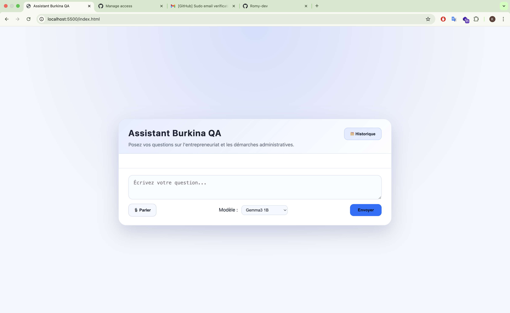
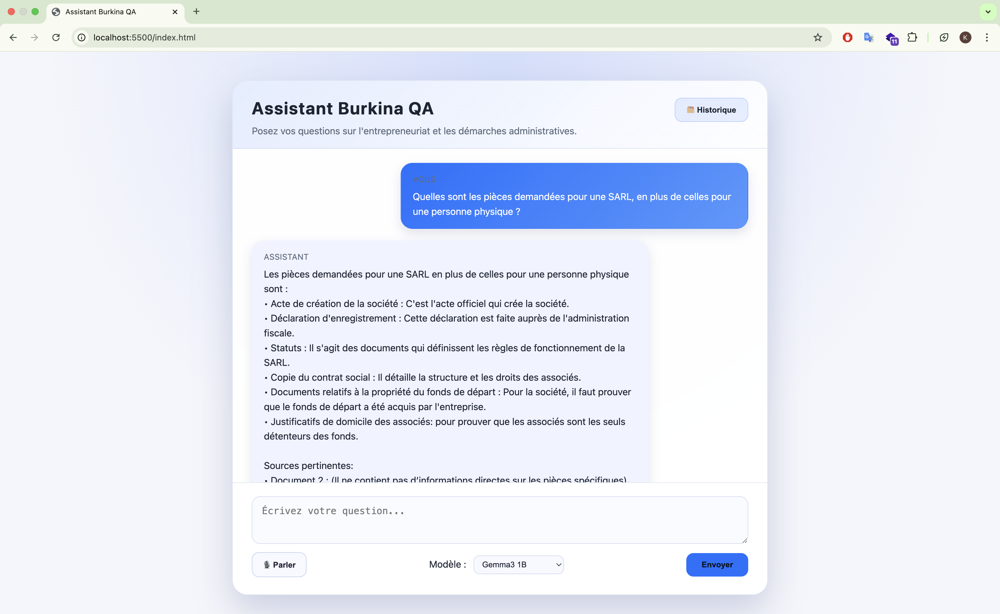

# Burkina Data Collector & QA Assistant

Un outil complet pour :

- **Collecter** des pages web et des PDFs, les nettoyer, chunker et sauvegarder en JSONL.
- **Indexer** le corpus dans Qdrant avec des embeddings BGE-M3.
- **Interroger** le corpus via une API FastAPI (`/ask`) qui s'appuie sur Ollama pour la génération.
- **Visualiser et tester** l'assistant grâce à une interface web moderne (chat + dictée + lecture audio + historique).

---

## 1. Architecture

```
frontend/ (HTML/CSS/JS)
app/main.py (API FastAPI + service d'indexation)
scripts/ (collecte, extraction, chunking, déduplication)
data/ (corpus, sorties JSONL, rapports)
Dockerfile + docker-compose.yml
```

- **FastAPI** expose `/ask`, `/health` et sert aussi le frontend (http://localhost:8000/).
- **Qdrant** stocke les vecteurs (collection `burkina_corpus`).
- **Ollama** héberge les modèles de génération (ex. `gemma3:1b`).
- **Frontend** (http://localhost:8000/frontend/index.html) : chat en français, dictée vocale, écoute des réponses, historique stocké dans `localStorage`.





---

## 2. Prérequis

| Composant | Version recommandée | Notes |
|-----------|---------------------|-------|
| Python | 3.12 | Pour exécuter localement sans Docker |
| Docker / Docker Compose | Dernière version | Pour lancer l'ensemble en un clic |
| Ollama | ≥ 0.4 | Installer sur l'hôte (macOS/Linux/WSL) |
| Modèle Ollama | `gemma3:1b` (par défaut) | `ollama pull gemma3:1b` |
| Modèle embeddings | `BAAI/bge-m3` | Téléchargé automatiquement via `SentenceTransformer` |

> ⚠️ Les scripts de collecte / chunking peuvent écrire dans `data/`. Montez un volume si vous travaillez en Docker.

---

## 3. Démarrage express (Docker)

1. **Installer / lancer Ollama** sur votre machine (hors compose) et charger le modèle :
   ```bash
   ollama serve                            # lance l'API http://localhost:11434
   ollama pull gemma3:1b                   # modèle par défaut utilisé par l'API
   ```

2. **Démarrer Qdrant + l'API + le frontend** :
   ```bash
   cd data_collector-main
   docker compose up --build
   ```

3. **Accéder aux services** :
   - Interface web : http://localhost:8000/frontend/index.html (ou directement http://localhost:8000/)
   - API `/ask` : http://localhost:8000/ask (POST JSON)
   - Qdrant (UI) : http://localhost:6333/

4. **Arrêter** :
   ```bash
   docker compose down
   ```

> 💡 L'API appelle Ollama via `http://host.docker.internal:11434`. Sous Linux sans Docker Desktop, exposez manuellement le port (ou modifiez `docker-compose.yml`).

---

## 4. Démarrage manuel (hors Docker)

```bash
# 1. Configuration Python
python -m venv .venv
source .venv/bin/activate
pip install -r requirements.txt

# 2. Lancer Qdrant (Docker recommandé)
docker run -p 6333:6333 -p 6334:6334 qdrant/qdrant:v1.9.6

# 3. Lancer Ollama sur l'hôte
ollama serve
ollama pull gemma3:1b

# 4. Démarrer l'API FastAPI
PYTORCH_MPS_DISABLE=1 uvicorn app.main:app --host 0.0.0.0 --port 8000

# 5. Servir le frontend (optionnel si vous utilisez http://localhost:8000/)
python -m http.server 5500 --directory frontend
```

---

## 5. Pipeline de collecte & préparation

Les scripts restent disponibles pour enrichir/synchroniser le corpus :

| Étape | Commande | Description |
|-------|----------|-------------|
| Robots.txt | `python scripts/check_robots.py --url URL --out data/raw_html/robots.txt` | Vérifie les règles du site |
| Crawl | `python scripts/crawl_site.py --start-url URL --out-dir data/raw_html --max-pages 50` | Collecte de pages HTML |
| PDF → JSONL | `python scripts/pdf_extract.py --pdf-dir data/raw_pdfs --out data/corpus.jsonl` | Extraction texte |
| Chunking | `python scripts/chunker.py --in data/corpus.jsonl --out data/chunks.jsonl --mode chars --max-chars 500 --overlap 50` | Découpe des textes |
| Dédup | `python scripts/dedup.py --in data/chunks.jsonl --out data/dedup.jsonl` | Suppression de doublons |
| Nettoyage | `python scripts/clean_corpus.py --in data/dedup.jsonl --out data/corpus_cleaned.jsonl --min-words 50` | Filtrage |
| Indexation Qdrant | `python scripts/index_qdrant.py --input data/corpus_cleaned.jsonl --collection burkina_corpus --qdrant-url http://localhost:6333 --batch-size 64 --recreate --normalize` | Génération d'embeddings + upsert |

> ℹ️ Les scripts acceptent des options supplémentaires (`--help`).

---

## 6. API `/ask`

- Méthode : `POST http://localhost:8000/ask`
- Body JSON :
  ```json
  {
    "question": "Quelles sont les démarches pour obtenir un RCCM au Burkina Faso ?",
    "top_k": 4,
    "score_threshold": 0.4,
    "normalize": true,
    "timeout": 240,
    "ollama_model": "gemma3:1b"
  }
  ```
- Réponse :
  ```json
  {
    "answer": "...",
    "sources": [
      {"source": "mon_guide.pdf", "score": 0.73, "payload": {"url": "..."}}
    ]
  }
  ```
- Variables d'environnement utiles :
  | Nom | Défaut | Description |
  |-----|--------|-------------|
  | `QDRANT_URL` | `http://qdrant:6333` | Endpoint Qdrant |
  | `QDRANT_COLLECTION` | `burkina_corpus` | Collection utilisée |
  | `EMBED_MODEL` | `BAAI/bge-m3` | Modèle SentenceTransformer |
  | `OLLAMA_URL` | `http://host.docker.internal:11434` | Endpoint Ollama |
  | `OLLAMA_MODEL` | `gemma3:1b` | Modèle génératif par défaut |
  | `ALLOWED_ORIGINS` | `http://localhost:8000,http://127.0.0.1:8000` | CORS pour le frontend |

---

## 7. Frontend

- Accessible via http://localhost:8000/frontend/index.html (ou `/` si monté).
- Fonctionnalités :
  - Chat en français, reformulation des réponses (Markdown nettoyé).
  - Dictée (Web Speech API `fr-FR`).
  - Lecture audio (SpeechSynthesis API, voix française si dispo).
  - Historique (localStorage), possibilité de « Reposer » ou « Afficher » une ancienne question.
- Pour servir séparément : `python -m http.server 5500 --directory frontend`.

---

## 8. Licences & crédits

Ce projet est sous licence **MIT** (voir `LICENSE`). Les principaux composants tiers sont également sous licence permissive :

| Librairie / Service | Licence |
|---------------------|---------|
| FastAPI | MIT |
| Uvicorn | BSD |
| SentenceTransformers | Apache-2.0 |
| Transformers (HF) | Apache-2.0 |
| Qdrant Client | Apache-2.0 |
| Qdrant Server | Apache-2.0 |
| Ollama | MIT |
| BAAI/bge-m3 | MIT |
| Gemma / Phi / TinyLlama (chez Ollama) | MIT / Apache (selon modèle) |
| Bootstrap CSS-like design custom | MIT (personnalisé) |

Veuillez vous référer aux dépôts respectifs pour les détails des licences de modèles.

---

## 9. Commandes utiles

| Action | Commande |
|--------|----------|
| Construire l'image | `docker compose build` |
| Démarrer (API + Qdrant) | `docker compose up` |
| Arrêter | `docker compose down` |
| Indexer corpus (local) | `python scripts/index_qdrant.py ...` |
| Tester API | `curl -X POST http://localhost:8000/ask -H 'Content-Type: application/json' -d '{"question":"..."}'` |
| Accéder au frontend | `http://localhost:8000/frontend/index.html` |
| Accéder au dossier data dans le conteneur | `docker compose exec api ls data` |

---

## 10. Check-list avant la mise en service

- [ ] Qdrant est lancé (`docker compose up`).
- [ ] Ollama tourne sur l'hôte et le modèle souhaité est téléchargé (`ollama pull gemma3:1b`).
- [ ] Le corpus est indexé dans Qdrant (`scripts/index_qdrant.py`).
- [ ] Frontend accessible et fonctionnel (Tests vocaux + audio si nécessaire).

Bon hacking !
